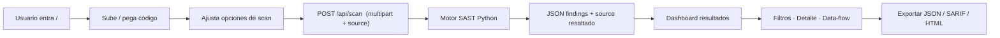

# PRD - SAST Analyzer Web

## 1. Visión General del Producto
Aplicación web para análisis estático de vulnerabilidades de código (SAST) en Python. Los usuarios podrán subir archivos `.py`, pegar código directamente o arrastrar un proyecto, y obtener un reporte de seguridad visual, interactivo y accionable — directamente desde el navegador sin instalación local.

- **Problema**: Las herramientas SAST existentes requieren CLI, setup o suscripciones. El desarrollador/estudiante necesita resultados inmediatos en una UI agradable.
- **Valor**: Provee análisis taint-style (source→sink) avanzado, clasificación CWE/OWASP, confianza por hallazgo, reportes HTML descargables, y despliegue one-click.
- **Usuarios objetivo**: Desarrolladores, estudiantes de seguridad, auditores de código, equipos docentes.

## 2. Características Principales

### 2.1 Roles de Usuario
No hay roles; la app es pública y de uso libre. Análisis 100% cliente + servidor (sin sesiones ni persistencia de código analizado).

### 2.2 Módulos de la Aplicación
1. **Landing / Home** — Hero con propuesta de valor, features, y zona de análisis principal (upload + paste).
2. **Panel de Análisis** — Área para pegar código, subir archivos (multi) o arrastrar y soltar; selector de confianza mínima; botón Analizar con spinner de progreso.
3. **Dashboard de Resultados** — Tarjetas de resumen (total / severidad), lista de findings filtrable, detalle expandible con data-flow, vista de código destacado, acciones (exportar JSON/SARIF/HTML, reset).
4. **Reglas Activas** — Sección informativa con las 8 reglas, severidad, CWE y descripción.
5. **FAQ / About** — Breve explicación de cómo funciona el análisis taint, limitaciones, créditos.

### 2.3 Detalle de Páginas / Vistas

| Vista | Módulo | Descripción de Funcionalidad |
|---|---|---|
| Home | Hero + CTA | Título impactante, badge "Online SAST · sin instalación", botón "Probar demo", acceso directo al analizador. |
| Home | Upload Zone | Dropzone de archivos `.py`/`.zip` con borde animado al drag; botón "Seleccionar archivos" fallback; chip contador. |
| Home | Code Editor | Editor textarea con resaltado de sintaxis ligero, números de línea, placeholder de ejemplo vulnerable, tabs "Pegar código" / "Subir archivo". |
| Home | Opciones | Slider confianza mínima (0–100%), toggles "incluir ejemplos de tests", severidad umbral. |
| Results | Summary Cards | 5 tarjetas con contadores por severidad (🔴🟠🟡🟢🔵) + total y barra de porcentajes. |
| Results | Findings List | Lista colapsable: severidad emoji + color, título, archivo:línea, CWE, barra confianza. Al expandir → Descripción, Evidencia, Data Flow paso a paso, Recomendación. |
| Results | Code View | Panel derecho con código fuente del archivo afectado, línea marcada con subrayado según severidad, hover muestra mini-tooltip con el finding. |
| Results | Export Bar | Botones: JSON · SARIF · HTML · Compartir (copia URL base64 opcional). |
| Rules | Reglas | Grid 2 cols con cada regla: ID, emoji severidad, título, CWE, descripción corta. |
| Layout | Navbar fija | Logo "🛡️ SAST Studio", nav: Analizador · Reglas · Acerca, botón modo claro/oscuro. |
| Layout | Footer | Versión, GitHub-ish, "Hecho con Python + React". |

## 3. Flujo Core

1. Usuario entra a `/` → ve dropzone y editor en paralelo.
2. Arrastra `vulnerable.py` o pega código → el editor se rellena con sintaxis.
3. Ajusta "Confianza mínima 80%" y pulsa **🔍 Analizar**.
4. Se muestra skeleton de 3 pasos → "Parseando AST → Detectando Taint → Generando Reporte".
5. Resultados aparecen con animación staggered: resumen superior + findings a la izquierda + código fuente a la derecha.
6. Usuario filtra por severidad, abre un hallazgo crítico y ve el data-flow L38→L45→L52 marcado en el código.
7. Exporta en HTML y descarga; o comparte.

## 4. Diseño de Interfaz

### 4.1 Estilo Visual
**Dirección estética: Cyber-Security Dashboard (Neon/Glassmorphism sobre fondo oscuro)**. Se siente como un panel de SOC real pero moderno.

- **Colores**:
  - Fondo: `#070B14` (azul noche profundo) + grano de textura sutil + gradiente radial verde-esmeralda en la esquina.
  - Primario: neón esmeralda `#00FFB3` (estado ok / accent).
  - Acento secundario: cian `#00D1FF`.
  - Severidades: `#FF3B6B` crítico, `#FF9A3C` alto, `#FFD23F` medio, `#3DDC97` bajo, `#5B8DEF` info.
  - Superficies: glass `rgba(20,30,48,0.65)` + border 1px `rgba(255,255,255,0.06)` + backdrop-blur 12px.
  - Tipografía:
    - Display / títulos: **Space Grotesk** (carácter tech).
    - Cuerpo: **Inter** (legibilidad).
    - Bloques de código: **JetBrains Mono** (monospace).
  - Iconografía: Emojis nativos (🛡️🔴⚡) + SVG custom para gráficas.
- **Botones**: Rectángulos con radio 10px, sombra neon verde sutil en primario; estados hover con brillo y micro-elevación.
- **Layout**: `grid 12-col` desktop. Navbar fija glass superior. En análisis: layout 3-col `[Filtros · Findings · Code]`.
- **Animaciones**:
  - Entrada con stagger 80ms a las tarjetas de resultados (Framer Motion / CSS).
  - Dropzone: pulso neon + borde vibrante al arrastrar.
  - Escaneo: barra de progreso de 3 etapas con animación shimmer.
  - Hallazgo expand: acordeón suave con rotación del cheurón.
- **Iconos/emoji**: Severidades con círculos de color + badge numérico. Tono directo y técnico, no juguetón.

### 4.2 Resumen de UI por Vista

| Vista | Módulo | Elementos UI Clave |
|---|---|---|
| Home | Hero | Grid glitch sutil, título con efecto gradient text, CTA doble "Analizar ahora" y "Demo 1-clic". |
| Home | Upload | Dropzone dashed neon verde, ícono nube flecha, preview chips con × de quitar. |
| Home | Editor | Num column, fondo más oscuro que superficie, keywords resaltadas ligeramente. |
| Results | Summary | Cards con counter animado, barra horizontal apilada con las severidades (progress stacked). |
| Results | Findings | Cada fila es glass-card con borde izq. color de severidad. |
| Results | Code | Highlight línea de la vulnerabilidad con fondo semitransparente según severidad. |

### 4.3 Responsividad
- **Desktop-first** (≥ 1280px): 3 columnas (filtros / findings / source).
- Tablet (768–1279px): 2 columnas (filtros arriba + findings y code en tabs).
- Móvil (< 768px): columna única, tabs entre "Resumen", "Hallazgos", "Código", touch targets ≥ 44px.

### 4.4 No Aplica 3D
Sin escenas 3D. El peso visual lo lleva el glassmorphism, micro-interacciones y el resaltado de código.
