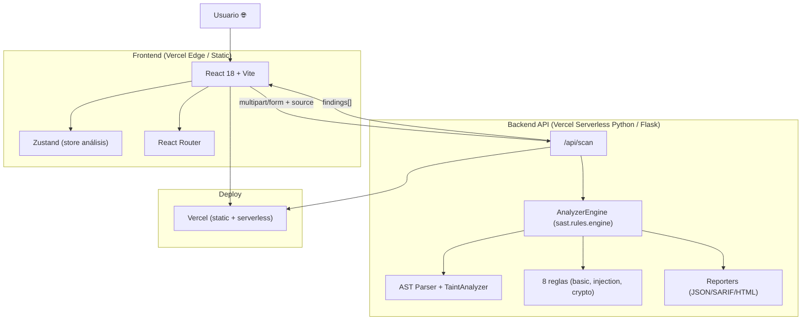
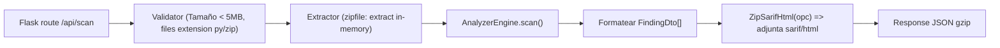

# Arquitectura Técnica — SAST Analyzer Web

## 1. Diseño de Arquitectura



## 2. Stack Tecnológico

| Capa | Tecnología | Motivo |
|---|---|---|
| Frontend | **React 18 + TypeScript + Vite 5** | DX rápido, build estático óptimo para Vercel. |
| Estilos | **Tailwind CSS v3** + CSS variables + custom keyframes | Clases utilitarias + glass + neon fácil. |
| Animaciones | **Framer Motion** + CSS nativo | Stagger reveals, acordeones, skeleton shimmer. |
| Sintaxis editor | **@uiw/react-codemirror** (theme dark, lang python) | Editor decente y ligero, no Monaco. |
| State | **Zustand** | Store global simple para `source`, `scanResult`, `filters`. |
| Router | **React Router v6** | SPA rutas `/`, `/rules`, `/about`. |
| Iconos | **Lucide React** + emojis nativos | Íconos SVG consistentes. |
| Backend API | **Flask 3 + Flask-Cors** | Reutiliza el módulo `sast/` Python directamente. |
| Serverless | **Vercel `api/*.py` (con runtime @vercel/python)** | Despliegue sin servidor, escala 0, gratis en tier hobby. |
| (alternativa) | **Node + exec a `python -m sast`** | Si Python serverless falla, pero Flask serverless es lo ideal. |
| Build | Vite build → `dist/` (static) + carpeta `api/` | Vercel automount static y serverless functions. |

## 3. Definición de Rutas (SPA)

| Route | Componente | Propósito |
|---|---|---|
| `/` | `pages/Home.tsx` | Landing + Upload + Editor + (condicional) Resultados |
| `/rules` | `pages/Rules.tsx` | Listado de reglas SAST activas, CWE, severidad |
| `/about` | `pages/About.tsx` | Explicación funcionamiento, limitaciones, créditos |
| `/demo` | *no page, action* | Carga demo source y ejecuta scan automático |
| `/api/scan` | *backend* | Endpoint de análisis |
| `/api/rules` | *backend* | Lista de reglas (también sirve para client-side si quieres) |

## 4. API Definitions (Backend)

```typescript
// ====== POST /api/scan ======
// Accepta multipart/form-data O application/json
interface ScanRequest {
  /** Código fuente Python en string */
  source?: string;
  /** Múltiples archivos subidos (FormData) */
  files?: File[];
  /** Nombre lógico del archivo si es source string */
  filename?: string;
  /** 0 - 1 */
  min_confidence?: number;
  /** Severidad mínima: critical | high | medium | low | info  (inclusive) */
  min_severity?: string;
  /** Excluir tests */
  exclude_tests?: boolean;
  /** Formato de salida extra */
  include_sarif?: boolean;
  include_html?: boolean;
}

interface FindingDto {
  rule_id: string;
  title: string;
  severity: "critical"|"high"|"medium"|"low"|"info";
  file_path: string;
  line: number;
  column: number;
  end_line?: number;
  description: string;
  cwe?: string;
  owasp?: string;
  confidence: number;        // 0..1
  evidence: string;
  source?: string;
  sink?: string;
  data_flow?: Array<{ line:number; variable:string; step:number; }>;
  recommendation: string;
}

interface SummaryDto {
  critical: number; high: number; medium: number; low: number; info: number;
}

interface ScanResponse {
  ok: boolean;
  target: string;
  files_scanned: number;
  duration_ms: number;
  sast_version: string;
  summary: SummaryDto;
  findings: FindingDto[];
  /** Mapa path => source para code view */
  sources: Record<string, string>;
  /** Reportes extra */
  sarif?: any;
  html_report_url?: string;  // blob URL client-side
  /** Errores parseo */
  errors?: string[];
}

// ====== GET /api/rules ======
interface RuleDto {
  id: string;
  title: string;
  severity: string;
  cwe?: string;
  owasp?: string;
  description: string;
  recommendation?: string;
}
```

## 5. Arquitectura Servidor



- **Carpeta `api/index.py`** (entry Flask).
- Reutiliza `sast/` subido junto al proyecto; Vercel Python lo importa.

## 6. Data Model (client-side store Zustand)

```ts
interface SastStore {
  // Input
  mode: "paste" | "files";
  pasteValue: string;
  pasteFilename: string;
  files: Array<{ name: string; size: number; content: string }>;
  options: {
    min_confidence: number;   // 0..1
    min_severity: Severity;   // inclusive
    exclude_tests: boolean;
  };
  // Result
  status: "idle" | "loading" | "error" | "ready";
  progressStage: 0|1|2|3;
  result: ScanResponse | null;
  error?: string;
  // UI state
  activeSeverityFilter: "all" | Severity;
  expandedFindingId: string | null;
  activeFile: string;
  // Actions
  setMode(mode): void;
  setPaste(v, filename?): void;
  addFiles(list: File[]): Promise<void>;
  removeFile(name): void;
  clearFiles(): void;
  runScan(): Promise<void>;
  reset(): void;
  toggleExpand(key): void;
  setActiveSeverity(s): void;
}
```

## 7. Despliegue a Vercel

- `vercel.json` configura `rewrites` de `/api/*` hacia serverless Python, y `/**` al SPA.
- Variables de entorno: ninguna necesaria para MVP.
- Proyecto se conecta a repo GitHub y despliega automáticamente; o bien `vercel --prod` desde CLI.
- **Runtime Python**: Agregar en `api/scan.py` cabecera compatible con `@vercel/python` v3 (func handler).
- Build command frontend: `npm run build` → `dist/` servido como static.
- Limitaciones tier free: 10s max ejecución / serverless. Adecuado para archivos < ~2MB; escaneos grandes mostrarán advertencia.
