# 🛡️ SAST Studio — Analizador Estático de Seguridad Multilenguaje (OWASP Top 10 & Taint Analysis)


-10b981)
-success)

**SAST Studio** es una plataforma integral de **Análisis Estático de Seguridad de Aplicaciones (SAST)** diseñada con arquitectura desacoplada:
1. **Motor Core (`sast/`)**: Analizador léxico, sintáctico (AST) y de flujo de datos contaminados (*Taint Analysis: Source → Sanitizer → Sink*) con soporte para Python, JavaScript/TypeScript, PHP, Java, Go, C/C++, C# y SQL.
2. **Backend API MVC (`api/`)**: API REST modular (Controladores, Servicios, Modelos y Vistas) lista para despliegue Serverless en Vercel o ejecución local con Flask.
3. **Consola Web Interactiva (`web/`)**: Aplicación SPA en React + TypeScript + TailwindCSS para auditar código pegado, archivos/ZIPs o repositorios públicos de GitHub en tiempo real, con sugerencias interactivas de remediación (*Auto-Fix*) y exportación a **JSON, SARIF 2.1.0 y HTML**.

---

## 🏗️ Arquitectura del Sistema

```mermaid
flowchart LR
    subgraph Input["Fuentes de Entrada"]
        A1["Editor de Código"]
        A2["Archivos / ZIP"]
        A3["Repositorio GitHub"]
        A4["CLI (python -m sast)"]
    end

    subgraph Engine["Motor SAST (sast/)"]
        B1["PythonParser (AST + Multilenguaje)"]
        B2["TaintAnalyzer (Sources → Sanitizers → Sinks)"]
        B3["12 Reglas OWASP Top 10 / CWE"]
    end

    subgraph Output["Reportes y Remediación"]
        C1["UI Interactiva + Auto-Fix Snippet"]
        C2["SARIF 2.1.0 (GitHub Code Scanning)"]
        C3["Reporte Ejecutivo HTML / JSON"]
    end

    Input --> Engine --> Output
```



---

## 📋 Catálogo de Reglas de Seguridad Activas (12 Reglas OWASP / CWE)

| ID de Regla | Vulnerabilidad | Severidad | CWE | OWASP Top 10:2021 | Análisis |
| :--- | :--- | :---: | :---: | :--- | :--- |
| `SQL_INJECTION` | Inyección SQL | 🔴 Crítico | `CWE-89` | `A03:2021-Injection` | Taint Flow + AST + Regex |
| `COMMAND_INJECTION` | Inyección de Comandos OS | 🔴 Crítico | `CWE-78` | `A03:2021-Injection` | Taint Flow + `shell=True` |
| `INSECURE_DESERIALIZATION` | Deserialización Insegura (`pickle`, `yaml.load`) | 🔴 Crítico | `CWE-502` | `A08:2021-Integrity Failures` | AST + Multilenguaje |
| `PATH_TRAVERSAL` | Path Traversal / LFI | 🟠 Alto | `CWE-22` | `A01:2021-Broken Access Control` | Taint Flow + Regex |
| `XSS` | Cross-Site Scripting (Reflejado / DOM) | 🟠 Alto | `CWE-79` | `A03:2021-Injection` | Taint Flow + React/Vue/PHP |
| `SSRF` | Server-Side Request Forgery | 🟠 Alto | `CWE-918` | `A10:2021-SSRF` | Taint Flow (`requests`, `urllib`, `fetch`) |
| `HARDCODED_SECRET` | Secretos y Credenciales Expuestas | 🟠 Alto | `CWE-798` | `A07:2021-Auth Failures` | Entropía de Shannon + Patrones |
| `DANGEROUS_FUNCTION` | Uso de Funciones Peligrosas (`eval`, `exec`) | 🟠 Alto | `CWE-676` | `A03:2021-Injection` | AST + Multilenguaje |
| `WEAK_CRYPTO` | Criptografía Débil (`MD5`, `SHA1`, `DES`, `ECB`) | 🟠 Alto | `CWE-327` | `A02:2021-Cryptographic Failures` | AST + Constantes RSA |
| `INSECURE_PASSWORD_HASH` | Hash de Contraseña sin Sal / Débil | 🟠 Alto | `CWE-916` | `A02:2021-Cryptographic Failures` | Contexto AST de Asignación |
| `SECURITY_MISCONFIGURATION` | SSL `verify=False`, `debug=True`, CORS | 🟠 Alto | `CWE-295` | `A05:2021-Security Misconfiguration` | AST Keyword Analysis |
| `JWT_WEAKNESS` | Firma JWT Deshabilitada (`verify_signature: False`) | 🟠 Alto | `CWE-347` | `A07:2021-Auth Failures` | AST JWT Decode Analysis |

### 🧹 Reconocimiento Inteligente de Sanitizadores (`TAINT_SANITIZERS`)
Para minimizar falsos positivos, `TaintAnalyzer` reconoce funciones de sanitización y limpia el estado de contaminación según la categoría:
- **Universal (`*`)**: `int()`, `float()`, `bool()`, `uuid.UUID()`
- **XSS**: `html.escape()`, `markupsafe.escape()`, `bleach.clean()`, `urllib.parse.quote()`
- **Command Injection**: `shlex.quote()`, `pipes.quote()`
- **Path Traversal**: `os.path.basename()`, `werkzeug.utils.secure_filename()`

---

## 🚀 Instalación y Uso Rápido

### 1. Clonar e instalar dependencias Backend
```bash
git clone https://github.com/gs2018062254-sudo/Proyecto-Calidad.git
cd Proyecto-Calidad
pip install -r requirements.txt
```

### 2. Ejecutar el CLI de SAST
```bash
# Escanear un directorio o archivo con salida en consola
python -m sast scan ./examples

# Generar reporte en formato SARIF 2.1.0 o HTML interactivo
python -m sast scan ./examples -f sarif -o reporte.sarif
python -m sast scan ./examples -f html -o reporte.html

# Listar las 12 reglas activas
python -m sast rules
```

### 3. Levantar Backend API + Frontend Web Studio
```bash
# Terminal 1: Iniciar API Flask (Puerto 8000)
python -m api.index

# Terminal 2: Iniciar Frontend React + Vite (Puerto 5173)
cd web
npm install
npm run dev
```

---

## 🧪 Ejecución de Pruebas Automatizadas

```bash
python -m pytest -v
```
La suite valida los endpoints REST (`/api/health`, `/api/rules`, `/api/scan`, `/api/github/scan`), las capas MVC, protección contra *Zip Slip*, sanitizadores de flujo de datos y las 12 reglas OWASP Top 10 (`29 passed, 0 warnings`).
